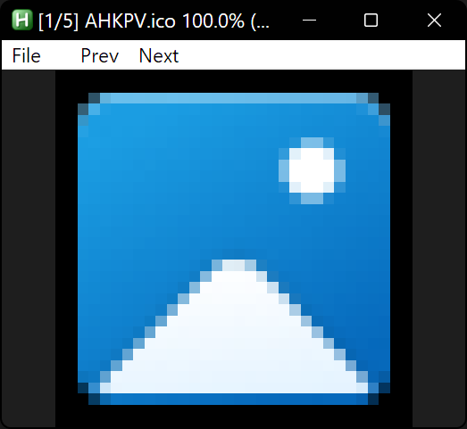

# ahk-picture-viewer

This is a simple picture viewer tool written in AHK

Support bmp, jpg, png and etc.

## How to start

Run "AHKPV.ahk"

## How to install

You can compile AHKPV.ahk to AHKPV.exe, and set image open with it.
And then goto `HKEY_CLASSES_ROOT\Applications\AHKPV.exe` and set it as below:

```reg
Windows Registry Editor Version 5.00

[HKEY_CLASSES_ROOT\Applications\AHKPV.exe\shell\open]
@="View (AHK)"
"Icon"="\"AHKPV.ico\""

[HKEY_CLASSES_ROOT\Applications\AHKPV.exe\shell\open\command]
@="\"AHKPV.exe\" \"%1\""
```

Then you will get this when you right click an iamge file:


## Screenshot



## Hotkeys

| Hotkey            | Action                        |
| ----------------- | ----------------------------- |
| Left              | Prev image                    |
| Right             | Next image                    |
| Ctrl + O          | Open file                     |
| Esc               | Exit                          |
| Up                | Zoom in                       |
| Down              | Zoom out                      |
| Mouse drag        | Move image                    |
| Space             | Fit with / fit window         |
| Enter             | Fit image                     |
| '                 | Fit height                    |
| 1                 | Zoom 100%                     |
| 2                 | Zoom 200%                     |
| 3                 | Zoom 300%                     |
| 4                 | Zoom 400%                     |
| 5                 | Zoom 500%                     |
| 6                 | Zoom 1000%                    |
| 7                 | Zoom 2000%                    |
| 8                 | Zoom 4000%                    |
| 9                 | Zoom 8000%                    |
| \                 | Maximize and Fit window / Zoom 100%   |
| /                 | Fit window / Zoom 100%        |
| BackSpace         | Fit size                      |
| Delete            | Move image to Recycle Bin     |
| Ctrl + C          | Copy image content            |
| Ctrl + Shift + C  | Copy image path               |
| Alt + Enter       | Open Properties               |

Check [file](./ahk_picture_viewer_hotkey.ahk)

## Copy as text

This function need ddddocr support, see <https://github.com/sml2h3/ddddocr>

## Special Thanks

* "AHK Picture Viewer" write by sbc <https://www.autohotkey.com/board/topic/58226-ahk-picture-viewer/>
* "image-viewer" write by langheran <https://github.com/langheran/image-viewer>
